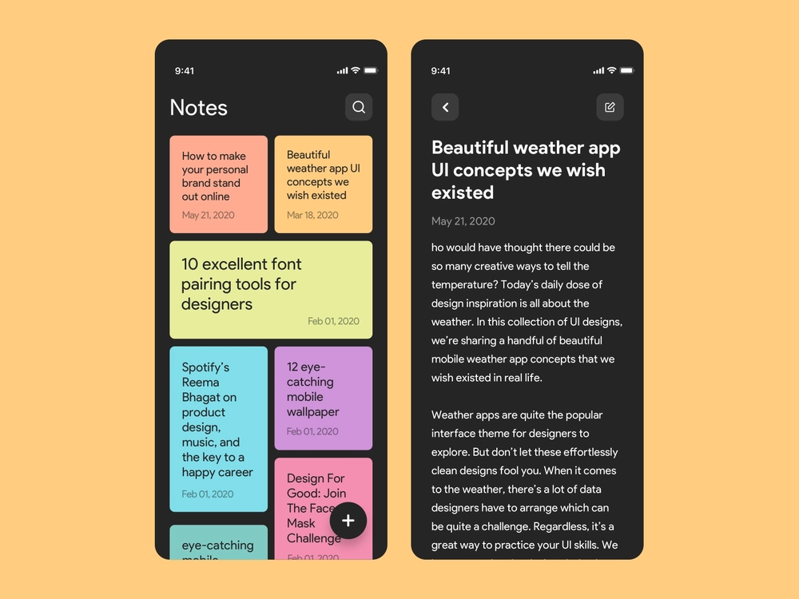
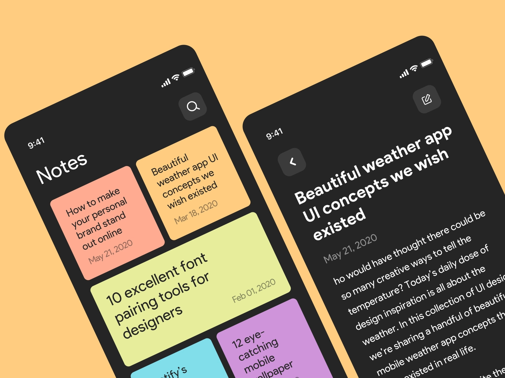
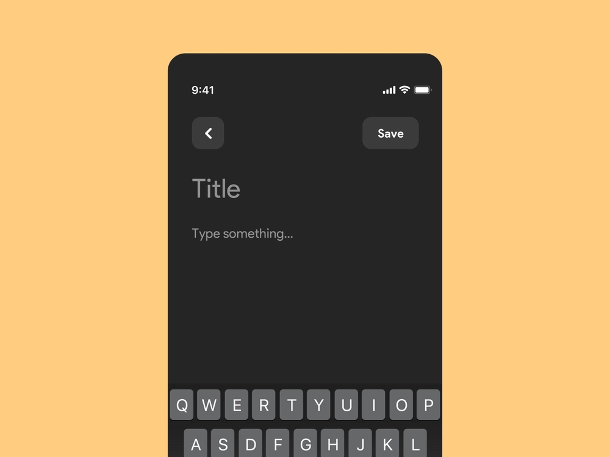

  <h1 align="center">Notes App</h1>

  <p align="center">
    A simple note app concept to save any idea quick and easy 📝✏
    <br />

### Built With

I have used Shared Preferences package as a database for my project. You can check out the technologies used from the links given below.
* [Flutter](https://flutter.dev/)
* [Dart](https://dart.dev/)
* [Shared Preferences](https://pub.dev/packages/shared_preferences)


### Installation

Best Compatible with Flutter 2.2

Run the following commands where you want to clone the project.
   ```sh
    git clone https://github.com/saimrahdari/Notes_App
    cd Notes_App
    flutter packages get
    flutter run
   ```

### Screenshots

</br>
</br>

</br>
</br>


### License

Distributed under the MIT License. See `LICENSE` for more information.

### Author

Saim Rahdari - [@saimrahdari](https://twitter.com/saimrahdari)

Project Link: [Notes App](https://github.com/saimrahdari/Notes_App)

Kindly give a ⭐ to the repo if you like it!

Copyright (c) 2021 Saim Rahdari
